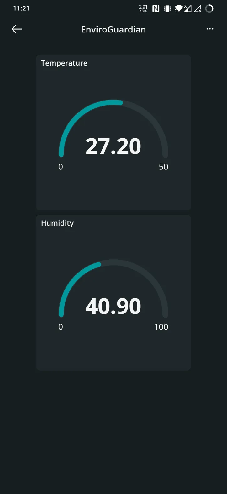

# EnviroGuardian

IoT-based air quality monitoring system using ESP8266 NodeMCU. Tracks temperature, humidity, air quality and CO levels via DHT22, MQ135 and MQ9 sensors. Features OLED display, LED indicators, audible alerts, and Arduino IoT Cloud integration for remote monitoring. Perfect for homes, classrooms and workspaces.

## Components

- **ESP8266 NodeMCU** (Main controller)
- **1.3" OLED Display SH1106** (I²C, 128x64 pixels)
- **DHT22 Sensor** (Temperature & humidity)
- **MQ135 Gas Sensor** (Air quality)
- **MQ9 Gas Sensor** (CO detection)
- **LEDs** (Green, Yellow, Red for traffic light status)
- **Buzzer** (Active, 3-9V for audible alerts)
- **Resistors** (10kΩ)
- **Jumper Wires**
- **Breadboard**

## Features

- Real-time monitoring of temperature, humidity, air quality, and carbon monoxide
- Visual alerts through traffic light system (Green, Yellow, Red)
- Audible alerts for dangerous conditions
- Cloud connectivity through Arduino IoT Cloud
- Remote monitoring and notifications
- 4 display modes (Clock, Temperature/Humidity, Air Quality, System Info)
- Beautiful startup animation and intuitive interface

## Images

### Project Overview

### Circuit Setup

